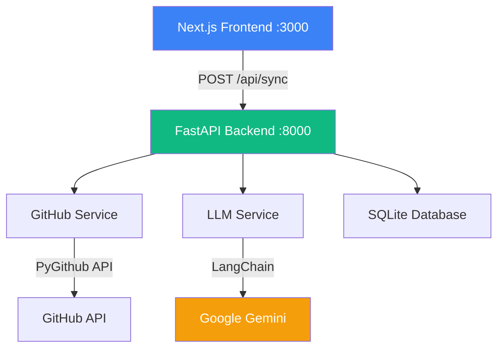

# GitPuller — Project Overview

> **Last Updated:** February 16, 2026
> An AI-powered learning tracker that analyzes your GitHub commits and extracts the technical concepts you're learning.

---

## What This Project Does

GitPuller connects to your GitHub account, pulls your recent commits, and sends the code diffs to an LLM (currently Google Gemini via LangChain). The AI identifies what technical concepts you learned — like "Used SQLAlchemy ORM for the first time" or "Implemented JWT authentication" — and stores them in a database. A Next.js dashboard (planned) will visualize your learning journey over time.

---

## Architecture



### How a Sync Works (Step by Step)

```
1. User clicks "Sync" in the frontend (or POST /api/sync via Swagger)
          │
2. FastAPI receives the request, injects a DB session via Depends(get_db)
          │
3. github_service.py authenticates with GITHUB_TOKEN
   └── Scans up to 50 repos for commits in the last 24 hours
   └── Collects code diffs (patches) for each commit
          │
4. llm_service.py sends diffs to LLM via LangChain
   └── Uses .with_structured_output(LearningAnalysis) 
   └── Returns List[LearningCreate] — validated Pydantic objects
          │
5. crud_learning.py bulk-inserts into SQLite via SQLAlchemy ORM
          │
6. FastAPI returns SyncResponse { message, count, items[] }
```

---

## Folder Structure

```
gitpuller/
├── .github/                    # CI/CD workflows (placeholder)
├── .gitignore                  # Ignores for Python + Node.js
├── README.md                   # Quick-start instructions
├── PROJECT_DOCS.md             # ← You are here
│
├── frontend/                   # Next.js 15 + React 19 + TypeScript
│   ├── package.json            # Dependencies (not yet installed)
│   ├── next.config.js          # Proxies /api/* → localhost:8000
│   ├── tsconfig.json           # TypeScript config with @/* alias
│   ├── app/
│   │   ├── layout.tsx          # Root HTML shell + metadata
│   │   ├── page.tsx            # Dashboard placeholder
│   │   └── components/         # React components (empty)
│   └── lib/                    # Frontend utilities (empty)
│
└── backend/                    # Python 3.11 + FastAPI
    ├── main.py                 # FastAPI app entry point
    ├── requirements.txt        # Python dependencies
    ├── .env.example            # Template for API keys
    ├── .env                    # Your actual API keys (gitignored)
    └── src/                    # All importable Python code
        ├── __init__.py
        ├── core/
        │   └── config.py       # Settings class (env vars)
        ├── db/
        │   ├── base.py         # SQLAlchemy engine + Base + init_database()
        │   └── session.py      # Session factory + get_db() dependency
        ├── models/
        │   └── learning.py     # Learning ORM model (DB table)
        ├── schemas/
        │   └── learning.py     # Pydantic schemas (validation + API contracts)
        ├── crud/
        │   └── crud_learning.py # Database read/write operations
        ├── services/
        │   ├── github_service.py  # Fetches commits via PyGithub
        │   └── llm_service.py     # LLM analysis via LangChain
        ├── agents/             # LangGraph AI workflows (planned)
        └── api/
            └── sync.py         # POST /api/sync endpoint
```

---

## File-by-File Breakdown

### Backend Entry Point

| File | Purpose |
|------|---------|
| `main.py` | Creates the FastAPI app, adds CORS middleware, registers routers, initializes DB on startup. Run with `python -m uvicorn main:app --reload` |

### `src/core/` — Configuration

| File | Purpose |
|------|---------|
| `config.py` | Loads `GITHUB_TOKEN`, `GEMINI_API_KEY`, `DATABASE_PATH`, and model settings from `.env`. Exposes a global `settings` singleton. |

### `src/db/` — Database Layer

| File | Purpose |
|------|---------|
| `base.py` | Creates the SQLAlchemy engine pointing to `data/app.db`. Auto-creates the `data/` directory. Provides `Base` (all models inherit from this) and `init_database()`. |
| `session.py` | Creates `SessionLocal` factory. Provides `get_db()` — a generator that FastAPI uses as a dependency to inject DB sessions into endpoints. |

### `src/models/` — ORM Models

| File | Purpose |
|------|---------|
| `learning.py` | Defines the `Learning` table: `id`, `date`, `repo`, `technology`, `concept`, `created_at`. Maps directly to the `learnings` table in SQLite. |

### `src/schemas/` — Pydantic Validation

| File | Key Classes |
|------|------------|
| `learning.py` | `LearningBase` — shared fields. `LearningCreate` — input validation. `LearningResponse` — API output (includes `id` + `created_at`). `LearningAnalysis` — schema the LLM must conform to. `SyncResponse` — API response for `/api/sync`. |

### `src/crud/` — Database Operations

| File | Key Functions |
|------|--------------|
| `crud_learning.py` | `create_learning()` — single insert. `create_learning_batch()` — bulk insert from validated Pydantic objects. `get_all_learnings()` — paginated read. `get_learnings_by_date()` / `get_learnings_by_repo()` — filtered queries. `delete_learning()` — delete by ID. |

### `src/services/` — External Integrations

| File | Purpose |
|------|---------|
| `github_service.py` | Authenticates with GitHub, scans repos for commits in the last 24 hours, extracts code diffs. Returns a list of dicts with `repo`, `commits`, and `patches`. |
| `llm_service.py` | Sends commit data to an LLM via LangChain's `.with_structured_output()`. Returns `List[LearningCreate]` — validated Pydantic objects. Currently uses Gemini, but LangChain makes it swappable. |

### `src/api/` — HTTP Endpoints

| File | Endpoints |
|------|-----------|
| `sync.py` | `POST /api/sync` — Orchestrates the full pipeline: fetch GitHub commits → analyze with LLM → save to DB → return results. |

---

## Key Design Patterns

### 1. Layered Architecture
```
API Layer (sync.py)         → Handles HTTP, validates input/output
Service Layer (llm, github) → Business logic, external API calls
CRUD Layer (crud_learning)  → Database operations only
Model Layer (models/)       → Table definitions
Schema Layer (schemas/)     → Data shapes (what goes in, what comes out)
```
Each layer only talks to the one below it. This keeps the code testable and swappable.

### 2. Dependency Injection (FastAPI)
Instead of manually creating DB sessions:
```python
# BAD: Manual session management
db = SessionLocal()
try:
    do_stuff(db)
finally:
    db.close()

# GOOD: FastAPI handles it automatically
@router.post("/sync")
def sync(db: Session = Depends(get_db)):
    do_stuff(db)  # Session auto-closes after response
```

### 3. Structured LLM Output (LangChain)
Instead of parsing raw JSON strings from the LLM:
```python
# BAD: Hope the LLM returns valid JSON
response = model.generate(prompt)
data = json.loads(response.text)  # Can crash!

# GOOD: LangChain enforces a Pydantic schema
structured_llm = llm.with_structured_output(LearningAnalysis)
result = structured_llm.invoke(messages)  # Always a valid LearningAnalysis
```

### 4. Schema Reuse
`LearningCreate` is used in three places:
- **LLM output** — inside `LearningAnalysis.learnings`
- **CRUD input** — `create_learning_batch(db, List[LearningCreate])`
- **API contract** — FastAPI validates against it

One schema definition, zero data format mismatches.

---

## Tech Stack

| Layer | Technology | Why |
|-------|-----------|-----|
| **Frontend** | Next.js 15, React 19, TypeScript | App Router, SSR-ready, type safety |
| **Backend** | FastAPI, Uvicorn | Async-ready, auto-generated Swagger docs, Pydantic-native |
| **Database** | SQLite + SQLAlchemy ORM | Zero-config for dev, ORM makes it swappable to Postgres later |
| **AI** | LangChain + Google Gemini | Provider-agnostic abstraction, structured output |
| **GitHub** | PyGithub | Full GitHub API access, handles auth + pagination |

---

## Environment Variables

| Variable | Description | Required |
|----------|-------------|----------|
| `GITHUB_TOKEN` | GitHub personal access token (needs `repo` scope) | ✅ |
| `GEMINI_API_KEY` | Google Gemini API key | ✅ |

---

## What's Done vs What's Planned

| Feature | Status |
|---------|--------|
| GitHub commit fetching | ✅ Done |
| LLM analysis with structured output | ✅ Done |
| SQLite storage with ORM | ✅ Done |
| FastAPI REST API | ✅ Done |
| Swagger documentation | ✅ Auto-generated |
| Monorepo structure | ✅ Done |
| Next.js frontend scaffold | ✅ Scaffold only |
| Dashboard UI (graphs, cards) | 🔲 Planned |
| LangGraph agent workflows | 🔲 Planned |
| CI/CD pipelines | 🔲 Planned |
| User authentication | 🔲 Planned |
